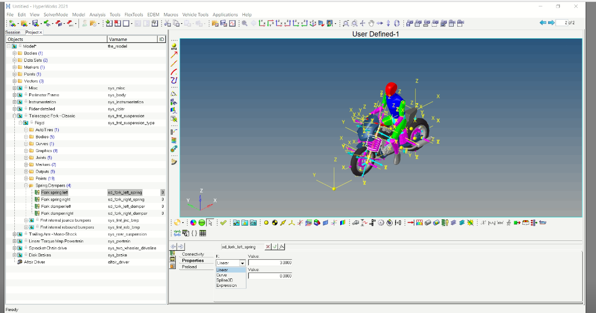
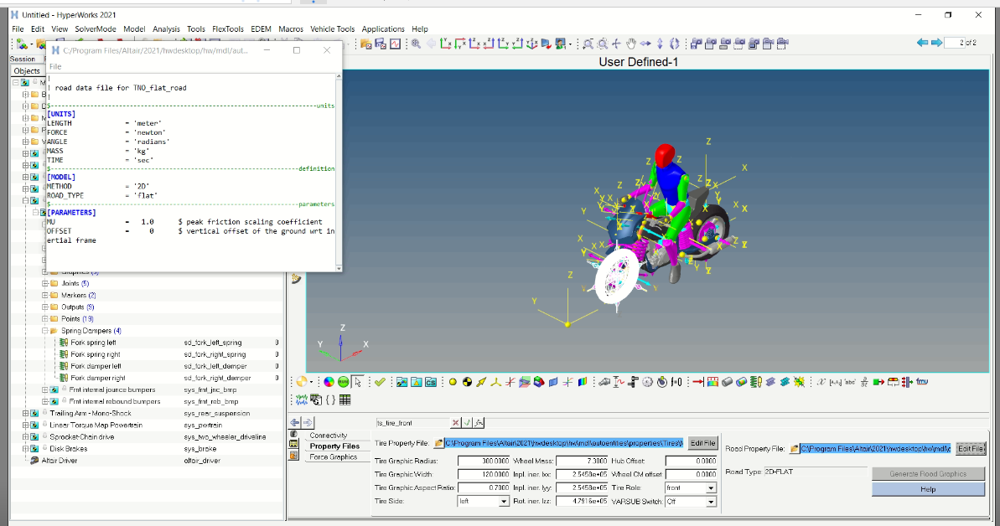
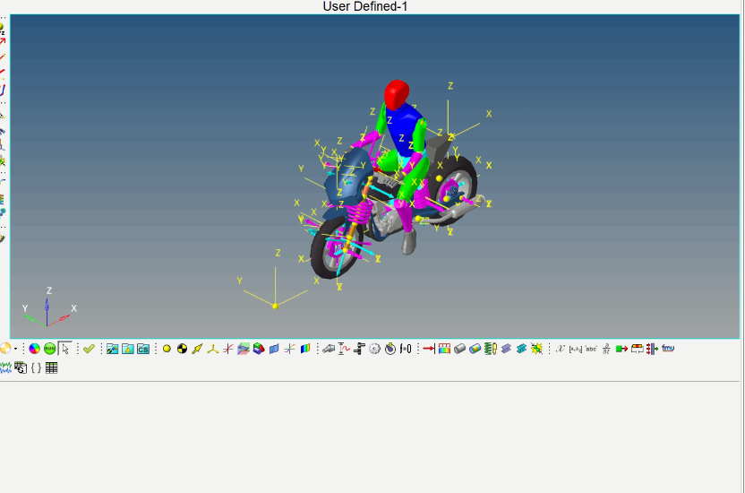
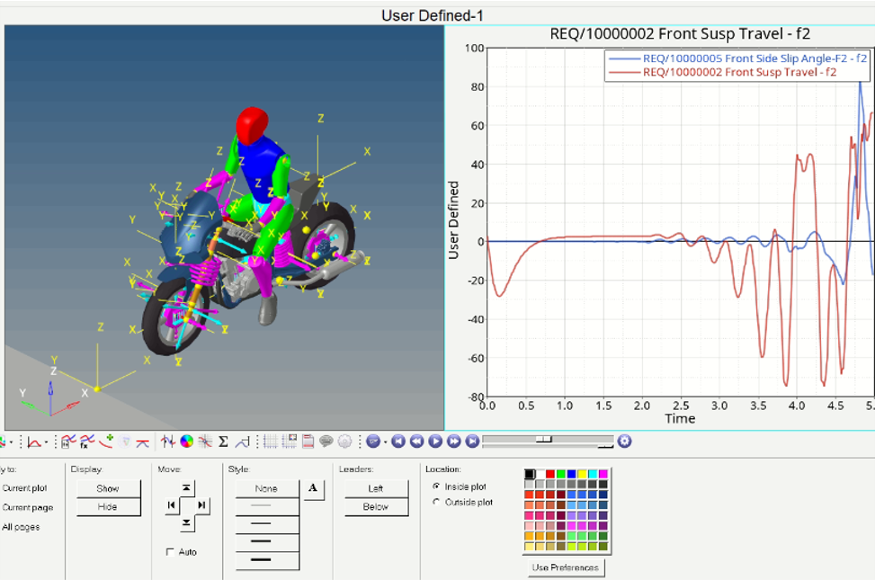
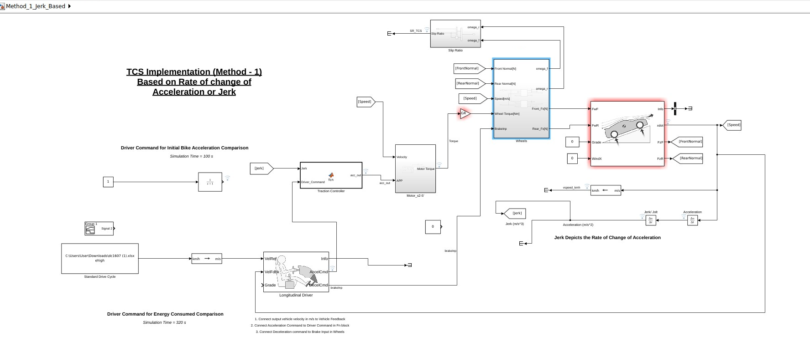
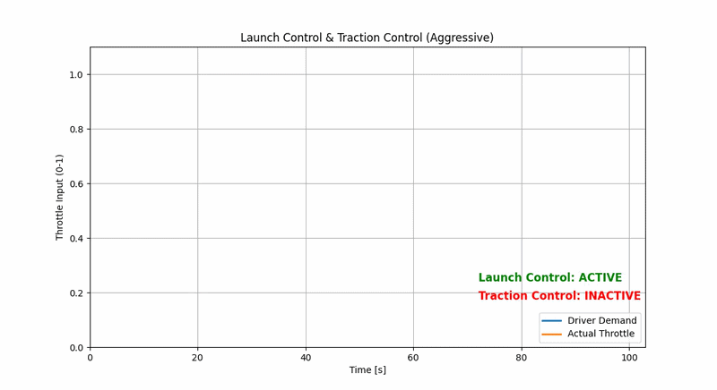

⭐ **1. Introduction**

Physical vehicle testing is often costly and time-consuming. This project leverages Altair MotionSolve and MATLAB/Simulink co-simulation to model and analyze vehicle dynamics in a virtual environment. By simulating real-world driving events, the workflow enables early performance evaluation, design optimization and improved ride comfort before physical prototyping of vehicle controllers and driver assist functions. 

<table>
  <tr>
    <td align="center">
      <b></b> 
      
       
      
        Source: <a href="https://community.altair.com/discussion/36772/two-and-three-wheeler-vehicle-dynamics-and-durability-in-motionsolve.com">2W Vehicle Dynamics - MotionView Demo</a>
      
    </td>
  </tr>
</table>

---

🧩 **2. Challenge**

Electric two-wheelers produce high instantaneous torque and respond much faster than traditional ICE vehicles. While this improves performance, it also increases the risk of **unexpected wheel slip**, especially during critical maneuvers such as fast corner exits, riding on low-μ or variable-μ surfaces (wet roads, gravel, sand), and sudden uphill acceleration.

This becomes more significant in markets like India, where users are transitioning from conventional vehicles to high-performance electric platforms, often without a matching change in driving behavior expectations.

To address this, the Slip Reduction system in this project needs to be designed as a real-time control layer that continuously monitors wheel slip, detects traction loss under varying conditions, and applies corrective measures to maintain vehicle stability and rider safety.

---

🎯 **3. Objectives**

- Develop and validate a digital twin of a 2-wheeler system to reduce physical testing effort and development time.
- Design a robust, real-time slip detection framework for proactive traction monitoring.
- Evaluate and validate controller-based corrective actions under different riding and road conditions.

--- 
🛠 **4. Tech Stack**

- **Altair MotionView / MotionSolve** – multibody vehicle dynamics modeling and system-level simulation
- **MATLAB / Simulink** – control system design, slip detection logic, and real-time co-simulation with plant models
- **Vehicle Dynamics & Tire Models** – longitudinal dynamics, tire slip estimation, and μ-split / low-traction scenario modeling
- **Control Systems (rule-based logic)** – corrective torque intervention and stability control strategy design

---

🧠 **5. Digital Twin Modelling**

Before controller development, the real-world electric 2-wheeler was replicated in Altair MotionView as a high-fidelity digital twin. The model includes the chassis, tire dynamics, powertrain, suspension, and rider inputs to closely represent real vehicle behavior.

The twin was validated using standard and real-world drive cycles, with a focus on matching key vehicle dynamics outputs against prototype data. The simulation achieved 92–95% correlation accuracy, making it suitable for downstream control system development and testing.

<table>
  <tr>
    <td align="center">
       
      <b>Vehicle & Rider Setup</b>: Set suspension and damping properties to match vehicle dynamics performance.
    </td>
    <td align="center">
       
      <b>Road & Environment Setup</b>: Configure road profiles, friction levels and driving conditions to match real world.
    </td>
  </tr>
  <tr>
    <td align="center">
       
      <b>Suspension Tuning</b>: Defines 2-wheeler parameters (inclusing frame CAD) and rider inputs/ driver behaviour to match baseline dynamics.
    </td>
    <td align="center">
       
      <b>Sensor Configuration</b>: Define virtual sensor locations to estimate critical quantities and control feedback.
    </td>
  </tr>
</table>

---

📉 **6. Control System Modelling**

- **Use-case analysis (TCS activation logic):** Evaluated acceleration/deceleration profiles to identify high-slip scenarios, highlighting maximum slip during vehicle launch and transient throttle/brake events.  
- **Jerk-based control:** Uses rate of change of acceleration to detect aggressive driver inputs and proactively reduce slip during dynamic driving conditions.  
- **Slip-ratio control:** Directly monitors slip ratio and modulates torque when predefined thresholds are exceeded for real-time traction regulation.  
- **Δω (wheel speed difference) control:** Tracks front–rear wheel angular velocity difference, optimized for launch control scenarios due to strong low-speed sensitivity.  
- **Hybrid TCS strategy:** Combines Δω control for launch and jerk-based control for cruising, validated through extensive testing across multiple driving maneuvers to ensure robust traction performance across the full operating range.

<table width="100%">
  <tr>
    <td align="center">
       
      <b>Example Model</b>: Controller Development on Simulink.
    </td>
  </tr>
</table>

---

🧪 **7. Validation Pipeline (MIL / SIL / HIL)**

The Slip Reduction system was validated through a step-by-step approach, moving from pure simulation to real-time interaction to ensure reliable controller behavior.

🔹 **Model-in-the-Loop (MIL)**  
The control logic was first tested inside a full vehicle simulation (Altair MotionView + Simulink). This helped verify whether the slip control strategy works correctly under different driving scenarios like launch, braking, and low-μ conditions.

🔹 **Software-in-the-Loop (SIL)**  
The same controller was then run as standalone software and tested against the simulated vehicle model. This ensured the implementation behaves correctly without relying on ideal simulation blocks.

🔹 **Hardware-in-the-Loop (HIL – Prototype Setup)**  
A simple physical interface (breadboard-based setup) was used to manually send throttle inputs to the system in real time. This helped observe how the controller reacts to live driver-like inputs and validated responsiveness beyond pure simulation.

This layered workflow helped progressively validate the system from simulation → software → real-time interaction, improving robustness and confidence in the final control design.

---
🧪 **8. Demo Results**

   
  <b>HIL Demonstration</b>: Manual throttle inputs applied through a prototype interface to evaluate real-time controller response.

   
  <b>HIL Demonstration</b>: Manual throttle inputs applied through a prototype interface to evaluate real-time controller response.

