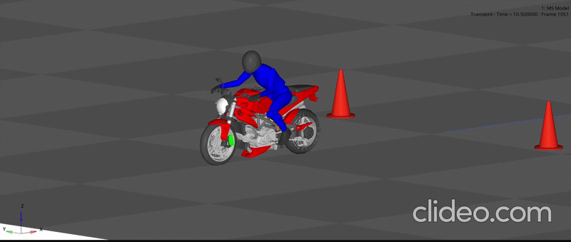

⭐ **1. Introduction**

Physical vehicle testing is often costly and time-consuming. This project leverages Altair MotionSolve and MATLAB/Simulink co-simulation to model and analyze vehicle dynamics in a virtual environment. By simulating real-world driving events, the workflow enables early performance evaluation, design optimization, and improved ride comfort before physical prototyping.

<table>
  <tr>
    <td align="center">
      <b></b> 
      
       
      
        Source: <a href="https://[your-link-here](https://community.altair.com/discussion/36772/two-and-three-wheeler-vehicle-dynamics-and-durability-in-motionsolve).com">Project Demo Video / Reference</a>
      
    </td>
  </tr>
</table>
